# BÁO CÁO THỰC HÀNH: ANDROID FORENSICS & REVERSE ENGINEERING
**Bài Thực Hành:** AndroidBreach Lab — SecureNotesSync

**Nhóm 14**:

**Họ và tên:** Võ Hoài Nam - 23520990

**Họ và tên:** Nguyễn Huỳnh Nhân - 23521080

**Môn học:** Digital Forensics

---

## Phần 1 — Kiểm Tra Toàn Vẹn (0,5 điểm)

### Câu 1. Xác minh tính toàn vẹn của các file trong evidence package.
**Trả lời:**
- **Kết quả kiểm tra (Mã Hash):**
device_dump/sdcard/Android/data/com.quickvault.sync.debug/files/outbox.json
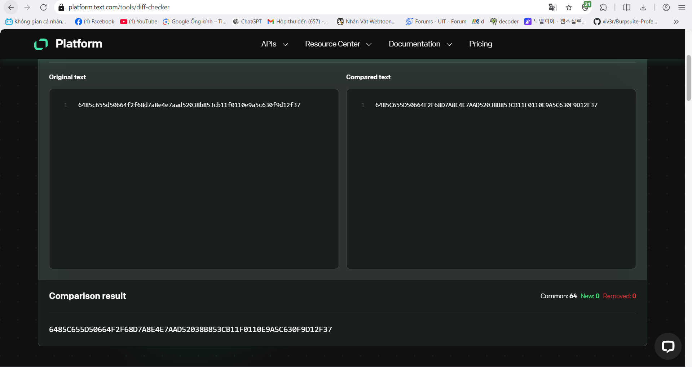
device_dump/sdcard/Android/data/com.quickvault.sync.debug/files/sync_cache.log
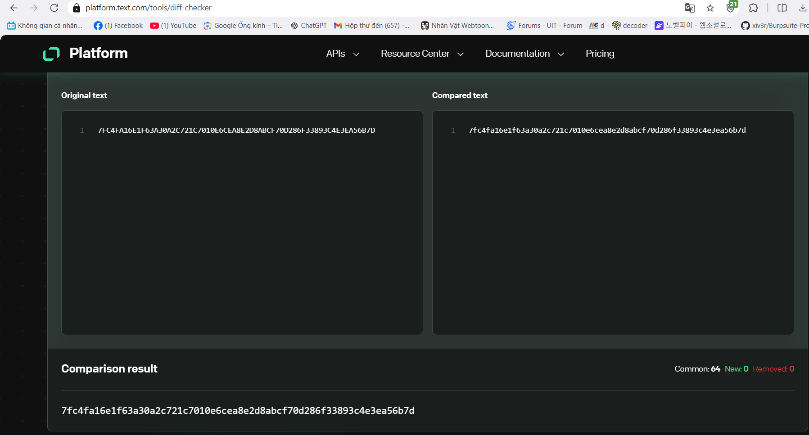
device_dump/apps/SecureNotesSync_v1.2.apk
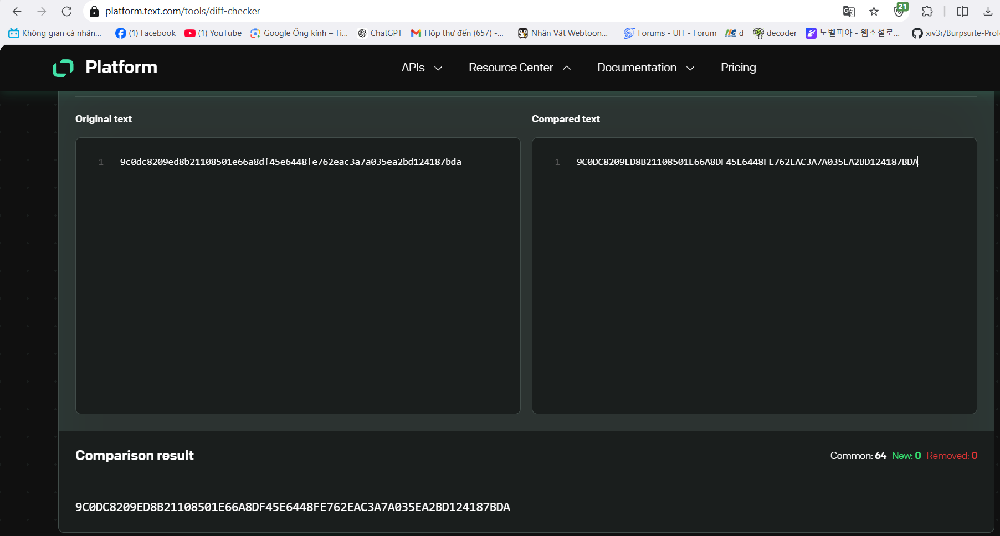
- **Giải thích:** Bước này là bắt buộc trong điều tra số nhằm đảm bảo bằng chứng (evidence) không bị thay đổi, giả mạo hoặc hỏng hóc trong quá trình thu thập và phân tích. Việc khớp mã hash chứng minh tính toàn vẹn và giá trị pháp lý của bằng chứng.

**Bằng chứng (Command/Output):**
` ` `bash
# [Nhập lệnh tạo/kiểm tra hash, ví dụ: sha256sum <file>]
` ` `

---

## Phần 2 — Phân Tích Tĩnh APK (3,5 điểm)

### Câu 2. Package name và SDK Version
**Trả lời:**
- **Package name:** `com.quickvault.sync.debug`
- **minSdk:** `26`
- **targetSdk:** `34`

**Bằng chứng:**: Sử dụng phần mềm online decompiler.com
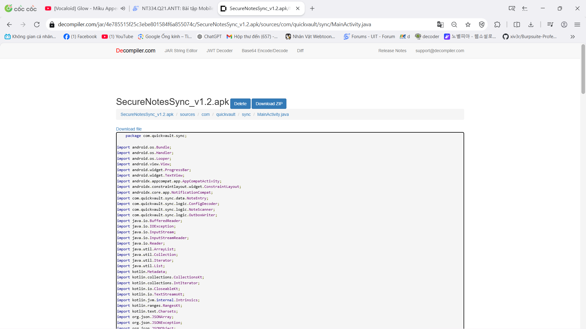
> 

### Câu 3. Quyền (Permissions) được khai báo
**Trả lời:**
- **Danh sách các quyền:**
  1. `android.permission.INTERNET`
  2. `android.permission.WRITE_EXTERNAL_STORAGE (với giới hạn maxSdkVersion="28")`
  3. `android.permission.READ_EXTERNAL_STORAGE (với giới hạn maxSdkVersion="32")`
  4. `com.quickvault.sync.debug.DYNAMIC_RECEIVER_NOT_EXPORTED_PERMISSION`

- **Quyền không phù hợp:** `READ_EXTERNAL_STORAGE và WRITE_EXTERNAL_STORAGE`
- **Giải thích:** Một ứng dụng có chức năng "ghi chú và đồng bộ" (SecureNotesSync) thông thường chỉ cần lưu trữ cơ sở dữ liệu ghi chú trong vùng nhớ riêng tư của nó (Internal Storage sandbox - /data/data/...). Việc yêu cầu quyền đọc và ghi trên bộ nhớ ngoài (External Storage) là quá rộng (over-privileged) và đáng ngờ. Quyền này cho phép ứng dụng quét, đọc và sao chép bất kỳ tài liệu, hình ảnh, hoặc file nào khác của người dùng lưu trên điện thoại, tạo ra nguy cơ rò rỉ dữ liệu (data exfiltration) rất lớn trong môi trường doanh nghiệp (công ty BrightWave)..

**Bằng chứng:**

### Câu 4. Thuộc tính đáng ngờ khác trong AndroidManifest.xml
**Trả lời:**
- **Thuộc tính:** `android:usesCleartextTraffic="true"`
- **Ý nghĩa:** `Thuộc tính này cho phép ứng dụng giao tiếp qua mạng bằng các giao thức bản rõ không được mã hóa (như HTTP thay vì HTTPS). Kẻ tấn công hoặc các hệ thống giám sát mạng có thể dễ dàng đọc được toàn bộ nội dung dữ liệu bị đánh cắp bằng cách bắt gói tin (sniffing/PCAP)`

**Bằng chứng:**

### Câu 5. Luồng thực thi của ứng dụng
**Trả lời:**
1. **Khởi động:** Bắt đầu tại class `com.quickvault.sync.MainActivity` (phương thức `onCreate()`).

2. **Kích hoạt tiến trình ngầm:**  từ đây gọi phương thức `startSyncRoutine()` Phương thức này tạo ra một Thread mới để chạy ngầm nhằm không làm đơ giao diện..
3. **Đọc dữ liệu gốc:** Trong luồng ngầm, gọi đến phương thức `loadNoteDataset()`để đọc toàn bộ dữ liệu ghi chú giả lập từ file mock_notes.json nằm trong thư mục assets.
4. **Lọc dữ liệu:** Chuyển danh sách ghi chú vừa đọc cho class NoteScanner, gọi phương thức resolveQueuedEntries() để phân tích và lọc ra các ghi chú mục tiêu (queued).
5. **Lấy cấu hình máy chủ:** `Gọi class ConfigDecoder, phương thức resolveEndpoint() và clientVersion() để lấy URL của máy chủ đích.`
6. **Đóng gói và Ghi file:** Gọi class OutboxWriter, phương thức commitPendingRecords() để ghi các ghi chú đã lọc xuống thiết bị và chuẩn bị gửi đi. Cuối cùng, cập nhật giao diện (UI) báo hoàn thành bằng uiHandler.

**Bằng chứng:**

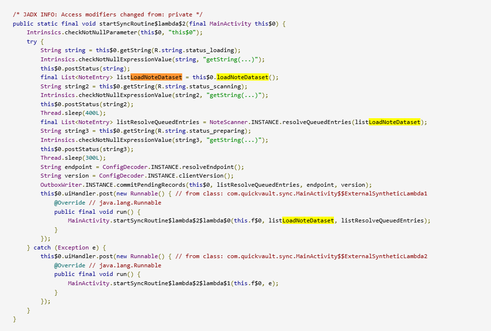
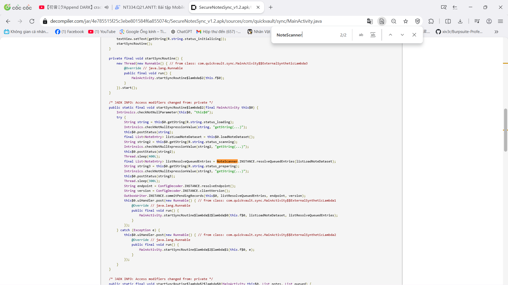
### Câu 6. Tiêu chí lọc dữ liệu
**Trả lời:**
- Ứng dụng lọc dữ liệu dựa trên các tiêu chí sau:
  - (?i)password\s*[=:]\s*\S+: Tìm kiếm chuỗi có chứa từ "password" (không phân biệt hoa/thường), theo sau là dấu "=" hoặc ":" và các ký tự liền kề (mật khẩu).
  - (?i)\bvpn\b: Tìm kiếm từ khóa "vpn" (không phân biệt hoa/thường).
  - (?i)\badmin\b: Tìm kiếm từ khóa "admin" (không phân biệt hoa/thường).
  - (?i)token\s*[=:]\s*\S+: Tìm kiếm chuỗi có chứa từ "token" (không phân biệt hoa/thường), theo sau là dấu "=" hoặc ":" (chuỗi xác thực).
  - (?i)\brecovery\b: Tìm kiếm từ khóa "recovery" (thường liên quan đến mã khôi phục tài khoản).
  - (?i)\bsftp\b: Tìm kiếm từ khóa "sftp" (giao thức truyền file bảo mật).
  - (?i)credential: Tìm kiếm từ khóa "credential" (thông tin đăng nhập).

**Bằng chứng:**   
> 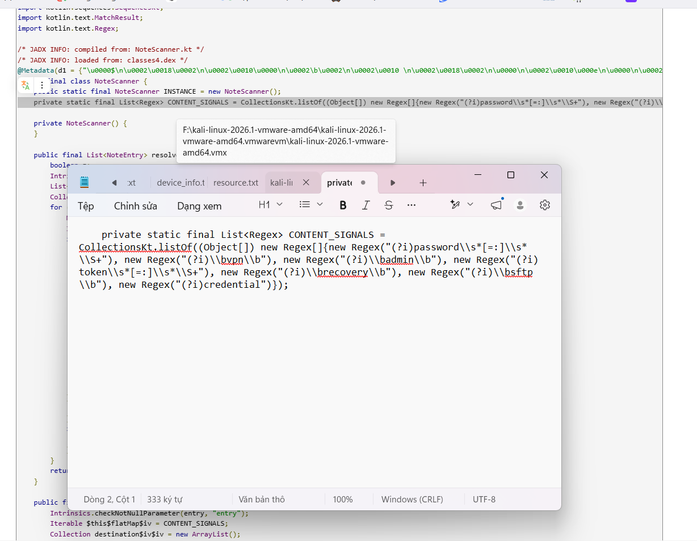

### Câu 7. Phân tích hằng số được mã hoá
**Trả lời:**
- **Hằng số tìm thấy (Encrypted/Encoded):** Trong class ConfigDecoder, có hai hằng số được mã hóa bằng Base64:
- Hằng số RC = "aHR0cHM6Ly90cmFpbmluZy5pbnZhbGlkL2FwaS91cGxvYWQ="
- Hằng số CV = "djEuNC4y"
- **Giá trị sau khi giải mã:** https://training.invalid/api/upload
- CV giải mã ra thành: v1.4.2
- **Ý nghĩa:** Giá trị RC chính là URL của máy chủ đích (C2 Server / Endpoint). Đây là địa chỉ web mà ứng dụng sẽ lén lút "tuồn" (upload) các ghi chú nhạy cảm của người dùng về đó.

**Bằng chứng:**
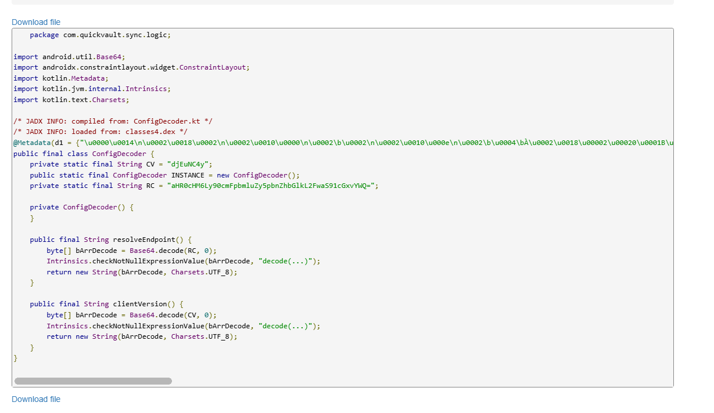
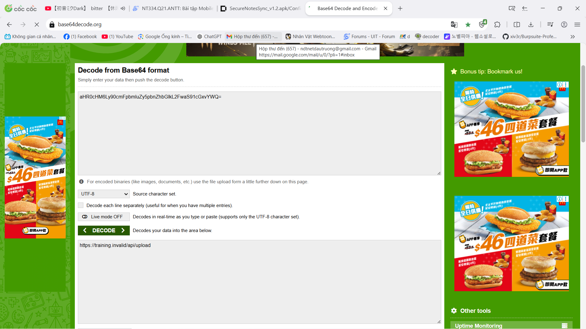
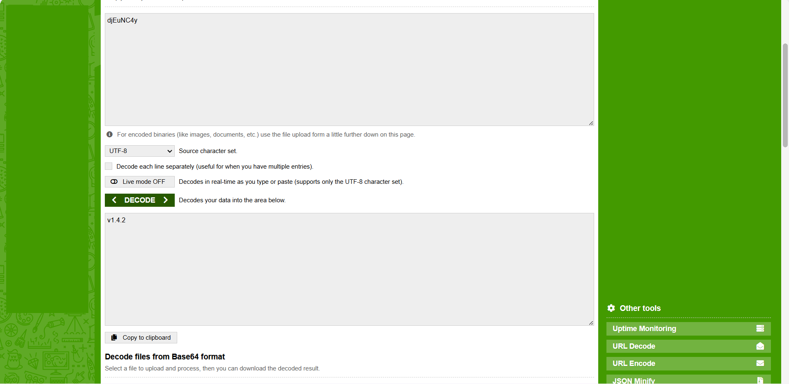

### Câu 8. File được ghi xuống thiết bị
**Trả lời:**
- **Các file được tạo:**
  1. outbox.json (chứa dữ liệu ghi chú bị đánh cắp).
  2. sync_cache.log (chứa nhật ký và cấu hình đồng bộ).
- **Đường dẫn đầy đủ trên thiết bị:** 
- Ưu tiên 1 (External Files Dir): /storage/emulated/0/Android/data/com.quickvault.sync.debug/files/
- Dự phòng (Internal Files Dir): /data/data/com.quickvault.sync.debug/files/

**Bằng chứng:**
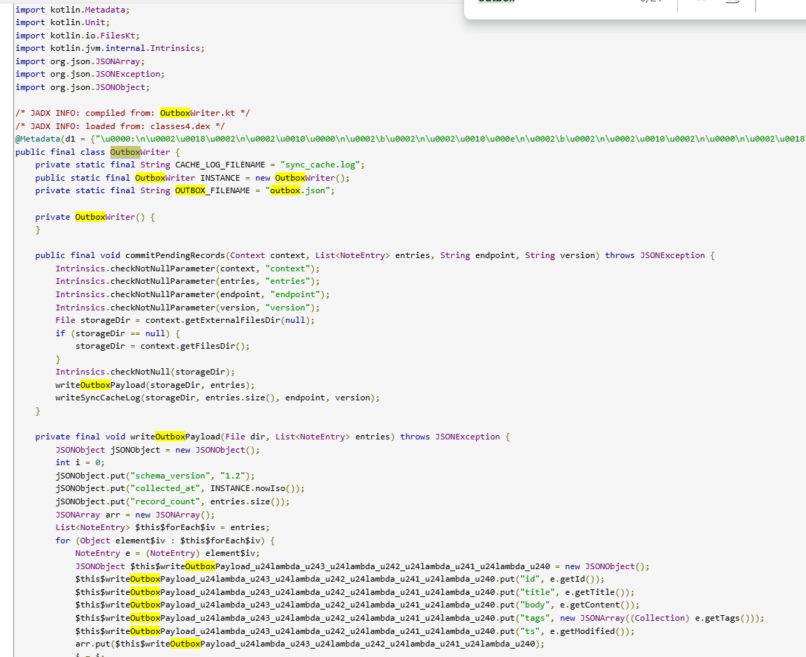
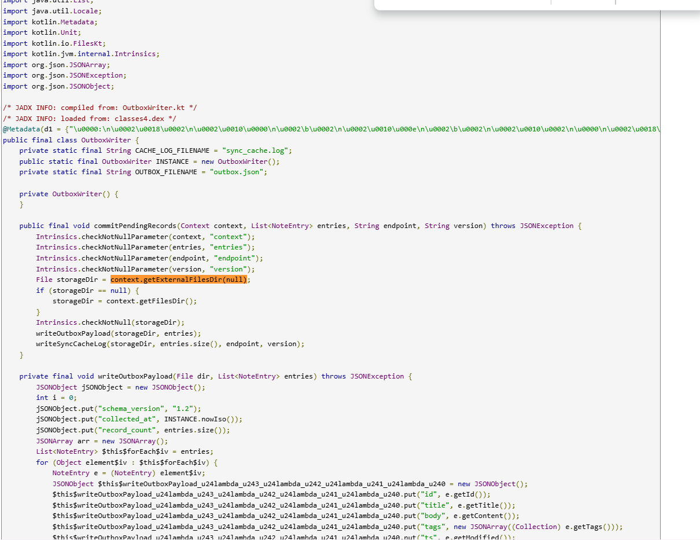
---

## Phần 3 — Phân Tích Artifact (3,5 điểm)

### Câu 9. Phân tích `outbox.json`
**Trả lời:**
- **Số lượng record:** `9`
- **Thời gian tạo:** `2026-04-20T15:11:02Z`
- **Cấu trúc mỗi record:** 

- id: Mã định danh của ghi chú (ví dụ: note_003).

- title: Tiêu đề của ghi chú (ví dụ: Home Network, VPN — Corporate Access).

- body: Nội dung chi tiết của ghi chú, nơi chứa các thông tin nhạy cảm.

- tags: Một mảng chứa các nhãn phân loại của ghi chú (ví dụ: personal, work, credentials).

- ts: Dấu thời gian (timestamp) lưu lại thời điểm ghi chú này được sửa đổi lần cuối (ví dụ: 2024-02-18T09:30:00Z).

**Bằng chứng:**
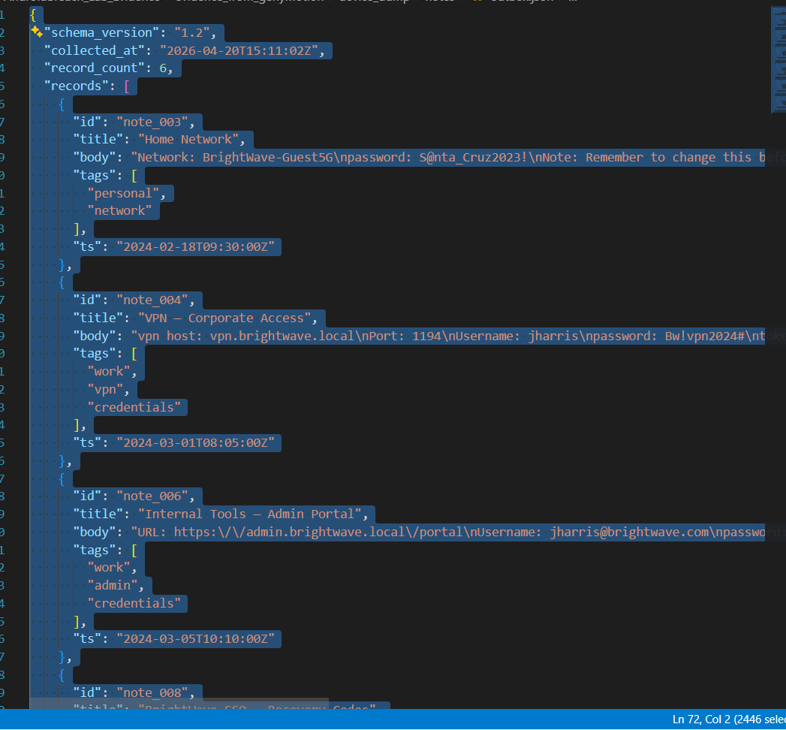

### Câu 10. Phân tích tiêu đề ghi chú bị thu thập
**Trả lời:**
- **Các tiêu đề bị thu thập:**

Home Network

VPN — Corporate Access

Internal Tools — Admin Portal

BrightWave SSO — Recovery Codes

SFTP — Reports Server

CI/CD Pipeline — Service Account
- **Nguyên nhân bị chọn:** Những ghi chú này bị chọn (thu thập) là do nội dung (body) hoặc tiêu đề (title) của chúng có chứa các từ khóa nhạy cảm khớp với danh sách các biểu thức chính quy (Regex) được lập trình sẵn trong file NoteScanner.java (đã phân tích ở Câu 6).

### Câu 11. Đối chiếu Dataset gốc
**Trả lời:**
- **Tổng số ghi chú trong APK:** `14`
- **Số ghi chú KHÔNG bị thu thập:** `8`
- **Điểm chung của các ghi chú không bị thu thập:** `là các ghi chú cá nhân thông thường như: danh sách đi chợ, ghi chú họp hành, lịch tập gym, gợi ý sách/podcast, kế hoạch du lịch, hoặc nhắc nhở công việc chung. Điểm chung quan trọng nhất là trong tiêu đề (title) và nội dung (content) của chúng không chứa bất kỳ từ khóa nhạy cảm nào (như password, vpn, admin, token, recovery, sftp) khớp với bộ lọc CONTENT_SIGNALS mà mã độc đã định nghĩa. Do đó, chúng bị bỏ qua.`

**Bằng chứng:**
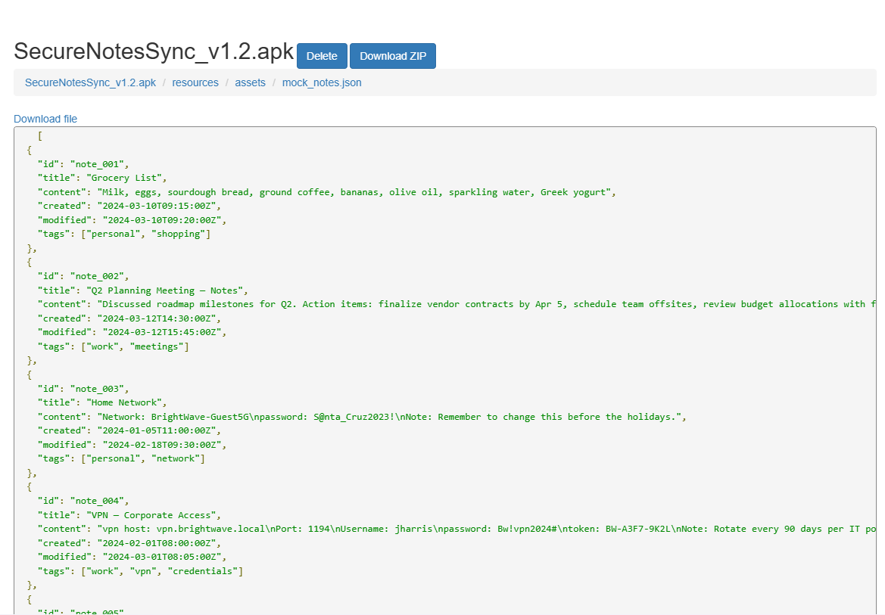

### Câu 12. Phân tích `sync_cache.log`
**Trả lời:**
- timestamp=2026-04-20T15:11:02Z: Dấu thời gian ghi log, khớp chính xác với thời điểm file outbox.json được tạo.

- client_version=v1.4.2: Phiên bản của ứng dụng.

- sync_endpoint=https://training.invalid/api/upload: Địa chỉ máy chủ từ xa (C2 Server) mà ứng dụng dự định gửi dữ liệu đến.

- queue_depth=6: Số lượng bản ghi chú đang chờ trong hàng đợi để gửi đi (khớp với 6 bản ghi nhạy cảm bị đánh cắp trong outbox.json).

- status=PENDING: Trạng thái hiện tại là "Đang chờ". Ứng dụng đã đóng gói xong dữ liệu nhưng chưa gửi đi (hoặc đang chờ kết nối mạng).

- transport=HTTPS/1.1 & content_type=application/json: Ứng dụng sẽ gửi file outbox.json qua giao thức HTTPS.

- retry_policy=exponential_backoff & max_retries=5: Cơ chế thử lại. Nếu việc gửi thất bại, nó sẽ thử lại tối đa 5 lần với thời gian chờ giữa các lần tăng dần.

**Bằng chứng:**
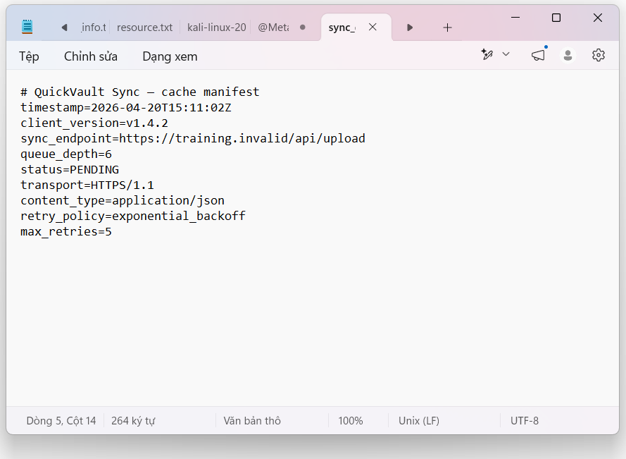
### Câu 13. Mối liên hệ giữa Câu 7 và `sync_cache.log`
**Trả lời:**
- Giá trị giải mã từ hằng số RC ở Câu 7 là https://training.invalid/api/upload. Giá trị này trùng khớp hoàn toàn với trường sync_endpoint được ghi nhận trong file sync_cache.log.

- Tương tự, giá trị giải mã từ hằng số CV ở Câu 7 là v1.4.2 cũng trùng khớp hoàn toàn với trường client_version trong file log.
- Mối liên hệ: Ứng dụng đã sử dụng thuật toán mã hóa (Base64 ở Câu 7) để che giấu địa chỉ máy chủ độc hại (C2 Server) nhằm qua mặt các hệ thống quét tĩnh tĩnh. Tuy nhiên, khi ứng dụng thực sự hoạt động và đóng gói dữ liệu (ở Câu 12), nó buộc phải giải mã chuỗi này để tạo thành một request mạng hoàn chỉnh. Quá trình này đã để lại dấu vết dạng bản rõ (plaintext) trong file nhật ký sync_cache.log.

### Câu 14. Phân tích `package_dump.txt` và `logcat.txt`
**Trả lời:**
- **Từ `package_dump.txt`:**
  1. Thời điểm cài đặt chính xác. * Bằng chứng: timeStamp=2026-04-20 15:11:01 và firstInstallTime=2026-04-20 15:11:01.
  2. Giá trị điều tra: Giúp điều tra viên xác định được chính xác "thời điểm số không" (Patient Zero) khi thiết bị bắt đầu bị nhiễm. Trùng khớp một cách logic với thời điểm file outbox.json được tạo ra (15:11:02 - tức là chỉ 1 giây sau khi cài đặt).
- **Từ `logcat.txt`:**
  1. Bằng chứng: flags=[ DEBUGGABLE HAS_CODE ALLOW_CLEAR_USER_DATA ALLOW_BACKUP ] và appId=10098.
  2. Giá trị điều tra: Xác nhận lại những phân tích tĩnh ở Câu 4 là hoàn toàn chính xác (app cố tình bật Allow Backup và Debug). Ngoài ra, biết được UID là 10098 (hay u0a98) giúp dễ dàng truy vết quyền sở hữu các file độc hại trên hệ thống Linux/Android.

**Bằng chứng:**
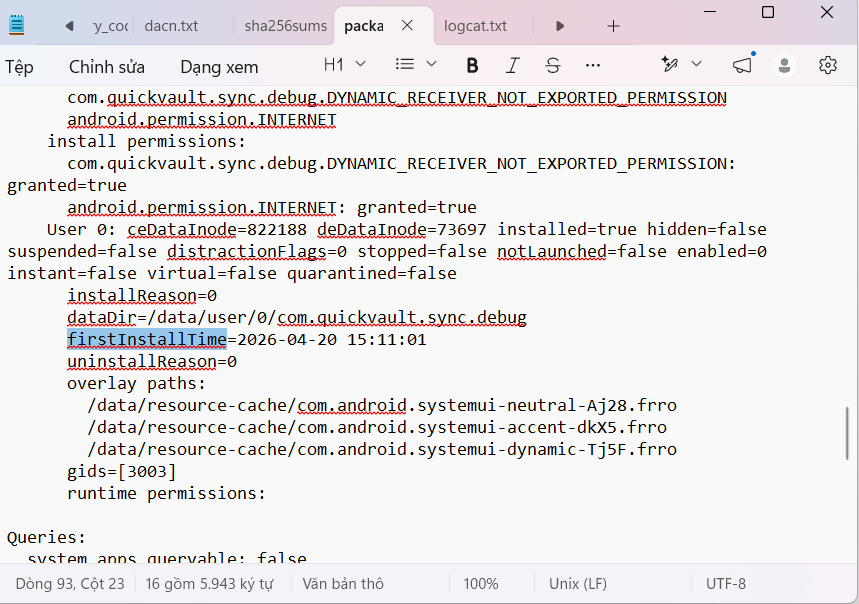
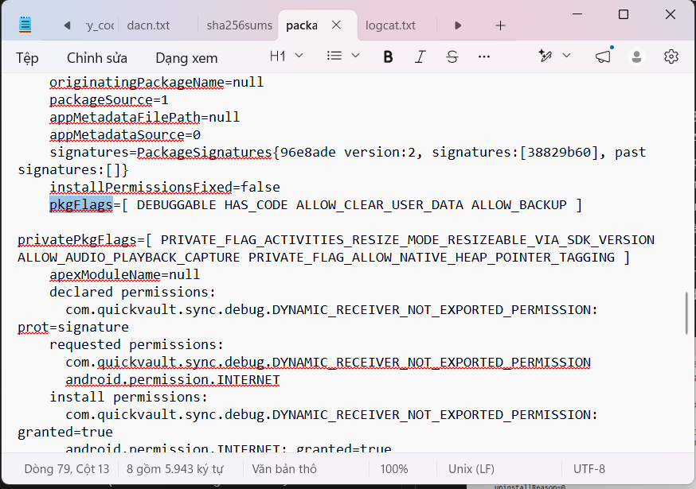

---

## Phần 4 — Tổng Hợp & Báo Cáo (2,5 điểm)

### Câu 15. Sơ đồ hành vi của ứng dụng
**Trả lời:**
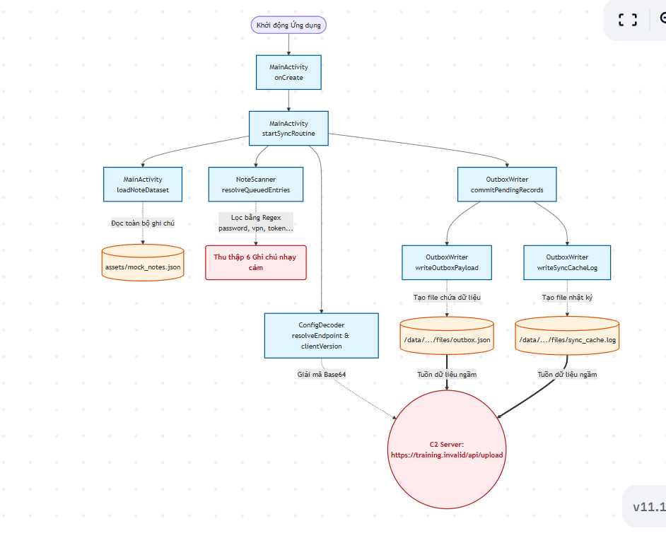
- **Sơ đồ:**
> *[Chèn ảnh sơ đồ tại đây]*

- **Diễn giải:** 
1. Khởi chạy: Ứng dụng bắt đầu tại MainActivity, ngay lập tức gọi hàm startSyncRoutine() chạy ngầm.

2. Thu thập: Nó đọc toàn bộ dữ liệu từ bộ nhớ qua loadNoteDataset().

3. Sàng lọc: Chuyển dữ liệu qua NoteScanner.resolveQueuedEntries() để lọc ra các ghi chú chứa từ khóa nhạy cảm (mật khẩu, vpn...).

4. Giải mã đích đến: Dùng ConfigDecoder.resolveEndpoint() để giải mã Base64, lấy URL của máy chủ Command & Control (C2).

5. Đóng gói & Ghi file: Truyền dữ liệu sang OutboxWriter.commitPendingRecords() để ghi file outbox.json (chứa dữ liệu trộm) và sync_cache.log (nhật ký trạng thái).

6. Exfiltration: Ứng dụng chuẩn bị gửi (hoặc liên tục thử gửi) toàn bộ dữ liệu này lên máy chủ từ xa.

### Câu 16. Indicators of Compromise (IoC)
**Trả lời:**
| STT | Loại IoC (Type) | Giá trị (Value) / Dấu hiệu nhận biết | Cách phát hiện (Detection Method) |
|---|---|---|---|
| **1** | **Network / URL** | `https://training.invalid/api/upload` (Domain: `training.invalid`) | **Phân tích mạng:** Kiểm tra nhật ký tường lửa, DNS logs, Proxy hoặc cấu hình cảnh báo trên hệ thống IDS/IPS để tìm các endpoint kết nối đến domain này. |
| **2** | **Host / Package Name** | `com.quickvault.sync.debug` | **Kiểm tra thiết bị:** Sử dụng hệ thống quản lý thiết bị di động (MDM) để quét danh sách ứng dụng, hoặc dùng lệnh `adb shell pm list packages | grep quickvault`. |
| **3** | **Host / File Artifact** | File: `outbox.json` Đường dẫn: `.../com.quickvault.sync.debug/files/outbox.json` | **Forensics:** Trích xuất file system của thiết bị, tìm kiếm tệp tin chứa cấu trúc JSON lưu trữ thông tin bị đánh cắp trong thư mục app. |
| **4** | **Host / File Artifact** | File: `sync_cache.log` Chứa nội dung: `# QuickVault Sync — cache manifest` | **Quét chuỗi:** Tìm kiếm tệp tin log trong thiết bị. Dùng công cụ tìm kiếm nội dung (grep) để bắt chuỗi text đặc trưng. |
| **5** | **Static / Code String** | Chuỗi Base64: `aHR0cHM6Ly90cmFpbmluZy5pbnZhbGlkL2FwaS91cGxvYWQ=` | **YARA Rules / DLP:** Viết rule YARA quét mã nguồn APK. Nếu phát hiện tệp chứa chuỗi Base64 này (địa chỉ C2 mã hóa), có thể kết luận là mã độc. |

### Câu 17. Tương quan giữa Phân tích tĩnh và Phân tích Artifact
**Trả lời:**
- **Sự bổ sung cho nhau:** Phân tích tĩnh (Static Analysis - phân tích APK, mã nguồn) và Phân tích Artifact (Artifact Analysis - phân tích dữ liệu sinh ra trên thiết bị như file log, file json) là hai mặt của một đồng xu, bổ sung chặt chẽ cho nhau trong điều tra số:
  - **Phân tích tĩnh** giúp trả lời câu hỏi **"Ứng dụng CÓ THỂ làm gì và ĐỊNH làm gì?"** (Cho ta thấy kịch bản, logic code, tiêu chí lọc từ khóa regex, thuật toán mã hóa, và endpoint máy chủ C2).
  - **Phân tích Artifact** giúp trả lời câu hỏi **"Ứng dụng ĐÃ THỰC SỰ làm gì và HẬU QUẢ ra sao?"** (Cung cấp bằng chứng thực tế về thời điểm lây nhiễm, thiết bị nào bị ảnh hưởng, và dữ liệu cụ thể nào đã bị đóng gói gửi đi).

- **Nếu chỉ có một trong hai nguồn, chuyên gia điều tra sẽ bỏ sót:**
  - **Nếu BỎ SÓT Phân tích tĩnh (Chỉ có Artifact):** Điều tra viên sẽ thấy file `outbox.json` chứa 6 ghi chú và file `sync_cache.log`. Tuy nhiên, họ sẽ **không hiểu được bản chất và quy luật hoạt động** (tại sao 6 ghi chú này bị chọn mà các ghi chú khác thì không). Họ cũng có thể không chứng minh được URL C2 Server là do kẻ tấn công cố tình cài cắm vào code vì không tìm thấy hàm giải mã Base64.
  - **Nếu BỎ SÓT Phân tích Artifact (Chỉ có Phân tích tĩnh):** Điều tra viên có thể đọc hiểu toàn bộ mã nguồn và biết ứng dụng này rất nguy hiểm, nhưng lại **hoàn toàn không có bằng chứng thực tế** chứng minh thiết bị đã bị tổn hại. Họ sẽ không biết ứng dụng đã được chạy hay chưa, chạy lúc nào, và quan trọng nhất là **không biết chính xác những dữ liệu mật nào của công ty BrightWave đã lọt vào tay hacker** để tiến hành đổi mật khẩu/đóng kết nối kịp thời.

### Câu 18. Đánh giá mức độ nguy hiểm
**Trả lời:**
- **Mức độ nguy hiểm:** **RẤT CAO / NGHIÊM TRỌNG (CRITICAL)**.
- **Lập luận (Dựa trên bằng chứng thu thập được):**
  1. **Nhắm mục tiêu có chủ đích (Targeted Attack):** Khác với các mã độc thu thập dữ liệu rác, ứng dụng này được lập trình với bộ lọc Regex (Câu 6) nhắm thẳng vào "yết hầu" của hệ thống an ninh doanh nghiệp: `password`, `vpn`, `admin`, `token`, `recovery`, `sftp`. Điều này cho thấy kẻ tấn công hiểu rất rõ giá trị của thông tin xác thực.
  2. **Chiếm đoạt thành công dữ liệu tối mật:** Bằng chứng từ `outbox.json` (Câu 9, 10) cho thấy ứng dụng đã đánh cắp trót lọt các thông tin cực kỳ nhạy cảm của công ty BrightWave, bao gồm: Thông tin đăng nhập mạng VPN nội bộ, tài khoản Admin Portal, mật khẩu máy chủ SFTP, token truy cập CI/CD Pipeline (GitHub Actions), và thậm chí cả mã khôi phục (Recovery Codes) của hệ thống SSO.
  3. **Khả năng tẩu tán và lẩn tránh tinh vi:** Ứng dụng che giấu địa chỉ C2 Server bằng Base64 (Câu 7). Tệ hơn, cơ chế đồng bộ trong `sync_cache.log` (Câu 12) sử dụng `retry_policy=exponential_backoff`, nghĩa là mã độc cực kỳ "lì lợm", nó sẽ âm thầm chờ đợi và liên tục tìm cách gửi dữ liệu ra ngoài internet cho đến khi thành công, bất chấp mạng có chập chờn.
  4. **Hậu quả thực tế:** Nếu thiết bị này (đã cài ứng dụng) được dùng để kết nối vào mạng nội bộ của BrightWave, kẻ tấn công bên ngoài có thể sử dụng ngay lập tức các token và VPN credentials vừa trộm được để thâm nhập sâu vào hạ tầng công ty (Lateral Movement), leo thang đặc quyền (nhờ tài khoản Admin), đánh cắp tài sản trí tuệ hoặc triển khai Ransomware.

**Kết luận:** Sự xuất hiện của ứng dụng này trên thiết bị nhân viên là một sự cố bảo mật (Security Incident) cấp độ 1. Cần lập tức cách ly thiết bị, chặn domain `training.invalid` trên tường lửa công ty, và bắt buộc nhân viên đổi toàn bộ mật khẩu/thu hồi token đã bị lộ trong file `outbox.json`.

---
Github: https://github.com/Mai2el/MobileForensics.git