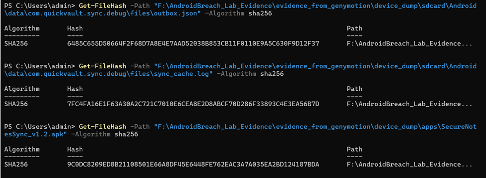
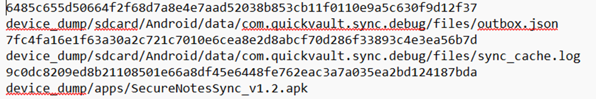
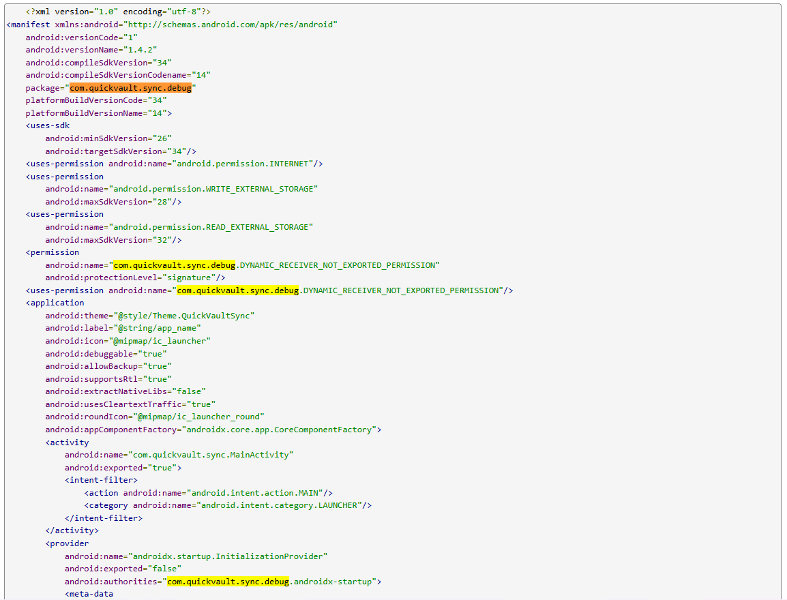
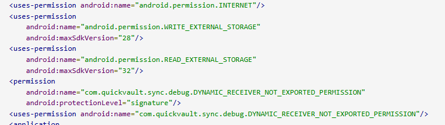
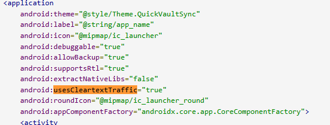
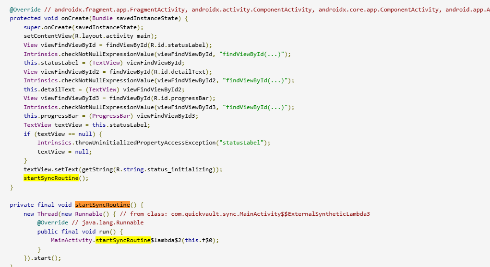

# BÁO CÁO THỰC HÀNH: ANDROID FORENSICS & REVERSE ENGINEERING
**Bài Thực Hành:** AndroidBreach Lab — SecureNotesSync
**Họ và tên:** [Nhập Họ và Tên của bạn]
**MSSV:** [Nhập MSSV của bạn]
**Môn học:** Digital Forensics

---

## Phần 1 — Kiểm Tra Toàn Vẹn (0,5 điểm)

### Câu 1. Xác minh tính toàn vẹn của các file trong evidence package.
**Trả lời:**
- **Kết quả kiểm tra (Mã Hash):**
  - Hash MD5/SHA256 của file ZIP gốc: `[Nhập mã hash]`
  - Hash của APK: `[Nhập mã hash]`
- **Giải thích:** Bước này là bắt buộc trong điều tra số nhằm đảm bảo bằng chứng (evidence) không bị thay đổi, giả mạo hoặc hỏng hóc trong quá trình thu thập và phân tích. Việc khớp mã hash chứng minh tính toàn vẹn và giá trị pháp lý của bằng chứng.

**Bằng chứng (Command/Output):**
` ` `bash
# [Nhập lệnh tạo/kiểm tra hash, ví dụ: sha256sum <file>]
` ` `

---

## Phần 2 — Phân Tích Tĩnh APK (3,5 điểm)

### Câu 2. Package name và SDK Version
**Trả lời:**
- **Package name:** `com.quickvault.sync.debug`
- **minSdk:** `26`
- **targetSdk:** `34`

**Bằng chứng:**
> 

### Câu 3. Quyền (Permissions) được khai báo
**Trả lời:**
- **Danh sách các quyền:**
  1. `android.permission.INTERNET`
  2. `android.permission.WRITE_EXTERNAL_STORAGE (với giới hạn maxSdkVersion="28")`
  3. `android.permission.READ_EXTERNAL_STORAGE (với giới hạn maxSdkVersion="32")`
  4. `com.quickvault.sync.debug.DYNAMIC_RECEIVER_NOT_EXPORTED_PERMISSION`

- **Quyền không phù hợp:** `READ_EXTERNAL_STORAGE và WRITE_EXTERNAL_STORAGE`
- **Giải thích:** Một ứng dụng có chức năng "ghi chú và đồng bộ" (SecureNotesSync) thông thường chỉ cần lưu trữ cơ sở dữ liệu ghi chú trong vùng nhớ riêng tư của nó (Internal Storage sandbox - /data/data/...). Việc yêu cầu quyền đọc và ghi trên bộ nhớ ngoài (External Storage) là quá rộng (over-privileged) và đáng ngờ. Quyền này cho phép ứng dụng quét, đọc và sao chép bất kỳ tài liệu, hình ảnh, hoặc file nào khác của người dùng lưu trên điện thoại, tạo ra nguy cơ rò rỉ dữ liệu (data exfiltration) rất lớn trong môi trường doanh nghiệp (công ty BrightWave)..

**Bằng chứng:**

### Câu 4. Thuộc tính đáng ngờ khác trong AndroidManifest.xml
**Trả lời:**
- **Thuộc tính:** `android:usesCleartextTraffic="true"`
- **Ý nghĩa:** `Thuộc tính này cho phép ứng dụng giao tiếp qua mạng bằng các giao thức bản rõ không được mã hóa (như HTTP thay vì HTTPS). Kẻ tấn công hoặc các hệ thống giám sát mạng có thể dễ dàng đọc được toàn bộ nội dung dữ liệu bị đánh cắp bằng cách bắt gói tin (sniffing/PCAP)`

**Bằng chứng:**

### Câu 5. Luồng thực thi của ứng dụng
**Trả lời:**
1. **Khởi động:** Bắt đầu tại class `com.quickvault.sync.MainActivity` (phương thức `onCreate()`).

2. **Kích hoạt tiến trình ngầm:**  từ đây gọi phương thức `startSyncRoutine()` Phương thức này tạo ra một Thread mới để chạy ngầm nhằm không làm đơ giao diện..
3. **Đọc dữ liệu gốc:** Trong luồng ngầm, gọi đến phương thức `loadNoteDataset()`để đọc toàn bộ dữ liệu ghi chú giả lập từ file mock_notes.json nằm trong thư mục assets.
4. **Lọc dữ liệu:** Chuyển danh sách ghi chú vừa đọc cho class NoteScanner, gọi phương thức resolveQueuedEntries() để phân tích và lọc ra các ghi chú mục tiêu (queued).
5. **Lấy cấu hình máy chủ:** `Gọi class ConfigDecoder, phương thức resolveEndpoint() và clientVersion() để lấy URL của máy chủ đích.`

**Bằng chứng:**

### Câu 6. Tiêu chí lọc dữ liệu
**Trả lời:**
- Ứng dụng lọc dữ liệu dựa trên các tiêu chí sau:
  - `[Tiêu chí 1: ví dụ - Từ khóa cụ thể trong nội dung/tiêu đề]`
  - `[Tiêu chí 2: ví dụ - Kích thước file, định dạng file]`

**Bằng chứng:**
> *[Chèn screenshot đoạn code chứa logic if/else hoặc regex dùng để lọc]*

### Câu 7. Phân tích hằng số được mã hoá
**Trả lời:**
- **Hằng số tìm thấy (Encrypted/Encoded):** `[Chuỗi mã hóa]`
- **Giá trị sau khi giải mã:** `[Chuỗi giải mã]`
- **Ý nghĩa:** Giá trị này được sử dụng để `[ví dụ: làm địa chỉ C2 server, URL webhook, hoặc khóa mã hóa AES]`.

**Bằng chứng:**
> *[Chèn screenshot đoạn code chứa hằng số và output của quá trình/tool giải mã (CyberChef/Script)]*

### Câu 8. File được ghi xuống thiết bị
**Trả lời:**
- **Các file được tạo:**
  1. `[Tên file 1]`
  2. `[Tên file 2]`
- **Đường dẫn đầy đủ trên thiết bị:** `/data/data/[package_name]/...`

**Bằng chứng:**
> *[Chèn screenshot đoạn code thực hiện thao tác File/FileOutputStream]*

---

## Phần 3 — Phân Tích Artifact (3,5 điểm)

### Câu 9. Phân tích `outbox.json`
**Trả lời:**
- **Số lượng record:** `[Số lượng]`
- **Thời gian tạo:** `[Trích xuất từ metadata hoặc nội dung file]`
- **Cấu trúc mỗi record:** Gồm các trường `[ví dụ: id, title, content, timestamp, is_synced]`.

**Bằng chứng:**
> *[Chèn screenshot một phần nội dung file outbox.json]*

### Câu 10. Phân tích tiêu đề ghi chú bị thu thập
**Trả lời:**
- **Các tiêu đề bị thu thập:**
  1. `[Tiêu đề 1]`
  2. `[Tiêu đề 2]`
- **Nguyên nhân bị chọn:** Các ghi chú này thỏa mãn tiêu chí lọc được tìm thấy ở Câu 6 (có chứa từ khóa `[...]`).

**Bằng chứng:**
> *[Chèn screenshot trích xuất danh sách tiêu đề từ outbox.json]*

### Câu 11. Đối chiếu Dataset gốc
**Trả lời:**
- **Tổng số ghi chú trong APK:** `[Số lượng]`
- **Số ghi chú KHÔNG bị thu thập:** `[Số lượng]`
- **Điểm chung của các ghi chú không bị thu thập:** `[Đặc điểm, ví dụ: Không chứa từ khóa nhạy cảm "mật khẩu", "tài chính"]`

**Bằng chứng:**
> *[Chèn screenshot so sánh dataset gốc và outbox.json]*

### Câu 12. Phân tích `sync_cache.log`
**Trả lời:**
- **Các trường trong file log:** `[Liệt kê các trường]`
- **Hành vi dự kiến:** File log này cho thấy ứng dụng đang theo dõi trạng thái `[ví dụ: kết nối mạng, thời gian sync cuối cùng, số lượng file đã upload thành công]` nhằm mục đích `[mô tả mục đích]`.

**Bằng chứng:**
> *[Chèn screenshot nội dung sync_cache.log]*

### Câu 13. Mối liên hệ giữa Câu 7 và `sync_cache.log`
**Trả lời:**
- Giá trị hằng số giải mã ở Câu 7 (`[Giá trị]`) xuất hiện hoặc liên quan trực tiếp đến nội dung trong `sync_cache.log` ở điểm: `[Giải thích sự khớp nối, ví dụ: URL endpoint trong Câu 7 chính là đích đến của các request được ghi nhận trong log]`.

**Bằng chứng:**
> *[Chèn screenshot đánh dấu sự đối chiếu giữa 2 dữ liệu]*

### Câu 14. Phân tích `package_dump.txt` và `logcat.txt`
**Trả lời:**
- **Từ `package_dump.txt`:**
  1. `[Thông tin 1: ví dụ - Thời gian cài đặt chính xác (firstInstallTime)]`
  2. `[Thông tin 2: ví dụ - Người dùng/UID chạy ứng dụng]`
- **Từ `logcat.txt`:**
  1. `[Thông tin 1: ví dụ - Exception/Lỗi lộ rõ hành vi gửi dữ liệu ngầm]`
  2. `[Thông tin 2: ví dụ - PID của process độc hại khi nó trigger hành vi]`

**Bằng chứng:**
> *[Chèn screenshot các dòng log/dump quan trọng]*

---

## Phần 4 — Tổng Hợp & Báo Cáo (2,5 điểm)

### Câu 15. Sơ đồ hành vi của ứng dụng
**Trả lời:**
*Mô tả sơ đồ (có thể vẽ bằng Draw.io, PlantUML hoặc Mermaid và chèn ảnh vào đây):*
- **Sơ đồ:**
> *[Chèn ảnh sơ đồ tại đây]*

- **Diễn giải:** Ứng dụng bắt đầu từ `[Class A].[Method X]` -> Đọc dữ liệu từ `[Đường dẫn dataset]` -> Lọc theo điều kiện -> Ghi ra file `[File name]` bằng `[Class B].[Method Y]` -> Lưu log tại `[Log file]` -> Gửi về `[Server]`.

### Câu 16. Indicators of Compromise (IoC)
**Trả lời:**
| STT | Loại IoC | Giá trị (Value) | Cách phát hiện |
|---|---|---|---|
| 1 | File Path | `/data/data/.../outbox.json` | Kiểm tra file system |
| 2 | File Path | `[Đường dẫn file log]` | Kiểm tra file system |
| 3 | Network/URL | `https://quantrimang.com/lang-cong-nghe/command-and-control-cho-phan-mem-doc-hai-la-gi-180962` | Phân tích lưu lượng mạng (PCAP/Proxy) |
| 4 | Hash (SHA256) | `[Hash của APK]` | Quét malware bằng MDM/EDR |
| 5 | Package Name | `com.brightwave...` | Dùng lệnh `adb shell pm list packages` |

### Câu 17. Tương quan giữa Phân tích tĩnh và Phân tích Artifact
**Trả lời:**
- Phân tích tĩnh cho ta biết **ứng dụng CÓ THỂ làm gì** (logic code, tiêu chí lọc, endpoint tĩnh). Phân tích artifact chứng minh **ứng dụng ĐÃ THỰC SỰ làm gì** trên thiết bị (dữ liệu nào đã bị trộm, thời điểm hoạt động).
- **Nếu bỏ sót phân tích tĩnh:** Không hiểu được quy luật hoạt động (tại sao file A bị lấy mà file B thì không), không tìm được các hằng số bị ẩn.
- **Nếu bỏ sót phân tích artifact:** Không có bằng chứng thực tế chứng minh thiết bị đã bị tổn hại và mức độ thiệt hại (dữ liệu nào đã lọt ra ngoài).

### Câu 18. Đánh giá mức độ nguy hiểm
**Trả lời:**
- **Mức độ:** `[Cao/Nghiêm trọng]`
- **Lập luận:** Bằng chứng cho thấy ứng dụng chủ động nhắm mục tiêu vào các dữ liệu nhạy cảm (dựa trên bộ lọc ở Câu 6), tự động đóng gói (`outbox.json`) và có khả năng tuồn dữ liệu ra ngoài (Câu 7, 12). Việc một thiết bị truy cập mạng nội bộ cài đặt ứng dụng này có thể dẫn đến lộ lọt tài sản trí tuệ hoặc thông tin xác thực của công ty BrightWave.

---